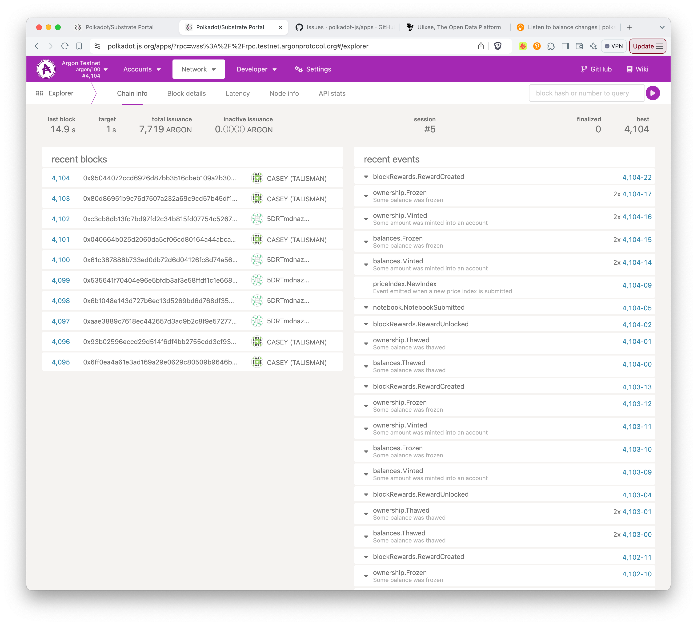

# Close Argon Blocks

> Your Localchain will automatically convert your settled micropayments into Argon Block votes, and you'll close some blocks! Find out here how to set it up.

## Background

Ulixee uses the Argon currency for Micropayments. When a datastore consumer runs a query, they will lock their Localchain with a set amount of Argons - this is called a Micropayment ChannelHold. Payment is now settled in tiny increments between the datastore and user. Once complete, the Datastore will send the Settled ChannelHold note to a notary and the Argon network.

Argon is a blockchain that uses proof of "work" to close blocks. However, in this case the work is the Datastore queries that you just served to users. Proof of work is supplied in the form of tax revenue from Datastore Micropayments, which are able to be converted into a "vote" on which block to close. If your vote is chosen, you get a portion of the rewards for closing the block.

Argon requires a tax on all transactions, which it uses to stabilize its value. For transactions over 1 Argon, this is set to ~20 cents (0.2 argons). For any micropayments (under 1 Argon), it is only 20% of the transaction value. So as your users pay for queries, you're actually automatically collecting a tax that you can use to close Argon blocks.

## Closing Blocks

When you setup your Datastore for payments, you'll configure the Argon Localchain that your Datastore will use. You'll also choose a specific Argon Miner that you believe is an honest operator.

Your Localchain collects payments and automatically claims the appropriate amount of tax when it settles with your chosen Argon Notary (`ARGON_NOTARY_ID`).

The Localchain can be setup to automatically create block votes if you set an `ARGON_BLOCK_REWARDS_ADDRESS` in your env, or you set it using the `@ulixee/cloud` command line. The Localchain will create votes with a strategy of voting anytime your collected tax exceeds the minimum vote threshold.

NOTE: you can code a more sophisticated strategy if you want to change this process. The code for creating votes can be currently traced in the Argon Mainchain codebase in [Localchain/src/balance_sync.rs](https://github.com/argonprotocol/mainchain/blob/416812ac0c905295dcf76472a68bee16d02e5f3c/localchain/src/balance_sync.rs#L508). A new strategy doesn't have to be in rust. There's a nodejs library to interact with the mainchain `@argonprotocol/mainchain`, as well as node interaction with the notary and localchain at `@argonprotocol/localchain`. You'll find uses of that library in this [project](.

## Securing you Block Rewards Address

Your block rewards account does not need to have a Localchain yet (you can always create one later that attaches to this private key). For that reason, you should generate your block rewards address, but only create a key. You should have a seed phrase and an account address once you're done. Do not publish the seed phrase to any CloudNode or anything public (like a code repository). This will separate your block rewards from your Localchain account - kind of like automatically depositing them into a more secure vault.

NOTE: In a production environment, you would create these with a hardware wallet or a secure offline computer.

For the Testnet, it's perfectly valid to follow the online Polkadot.js process to create an account [here](https://github.com/argonprotocol/mainchain/blob/3a4bfab8cb296b85da0543d577a2a33e85b83b54/docs/account-setup.md) or even reuse your Localchain account if you don't want to bother with this step.

## Watching for Closed Blocks

You can watch for closed blocks by listening to the Argon Mainchain. You can use the `@argonprotocol/mainchain` library to listen for new blocks and check if your vote was chosen. If your vote was chosen, you'll receive a reward in the form of Argons.

To monitor for blocks using your address, you could do something like this:

```typescript
import { getClient } from '@argonprotocol/mainchain';

const client = await getClient(`wss://rpc.testnet.argonprotocol.org`);
const eventMetadata = client.events.blockRewards.RewardCreated.meta;
const rewardsIndex = eventMetadata.fields.findIndex(x => x.name.toString() === 'rewards');
const unsub = mainchainClient.rpc.chain.subscribeNewHeads(async lastHeader => {
  const blockHash = lastHeader.hash.toHex();
  const blockNumber = lastHeader.number.toNumber();

  const events = await mainchainClient.query.system.events.at(blockHash);
  for (const { event } of events) {
    if (event.section === 'blockRewards' && event.method === 'RewardCreated') {
      const rewards = event.data[rewardsIndex].toJSON();
      for (const reward of rewards) {
        if (reward.accountId == '5DtCHcwuh7Mhp8cZtvinxDzSa36rh7m3TG9LFo3Tgxuyx889') {
          console.log(`You closed a block! (${blockNumber}: ${blockHash})`, JSON.stringify(reward));
        }
      }
    }
  }
});
```

Or you can use the Argon [developer console](https://polkadot.js.org/apps/?rpc=wss%3A%2F%2Frpc.testnet.argonprotocol.org#/explorer) UI to watch for your rewards (this is a common utility built by Polkadot, which produces the Substrate framework that Argon is built on top of. You should see a BlockRewards event with your address if you closed a block.


