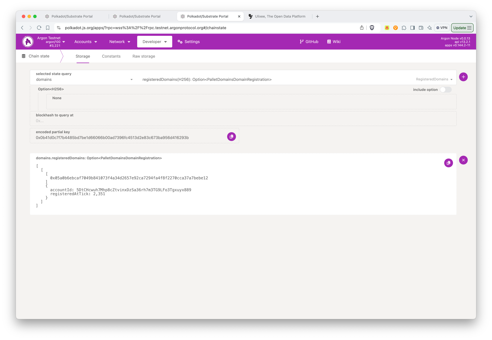

# Register a Domain

## Purpose

Domains serve a few purposes in Ulixee.

1. They allow users of your Datastore to run queries with a fixed domain name, instead of an ip address. This can change per version, so it operates like a DNS for versions of your Datastore.

   ```typescript
   const client = new Client(`ulx://baseball.stats/v1.0.0`);
   ```

   Here you can see the domain `baseball.stats` is used to connect to the Datastore. When a query initiates, it will lookup the IP and Datastore ID in the Argon network and use that information to connect. If you need to move your hosting, you can update the IP and Datastore ID in the Argon network and all clients will automatically connect to the new location. You can also host different versions of your Datastore at different hosts. This gives you flexibility to move your Datastore around while keeping links to it resilient.

2. As a Datastore operator, you define your payment information in the Domain, which allows you to safely use a Cloud Datastore hosting service because clients are configured to check for payment first. The Ulixee Foundation will launch a public cloud like this, but no launch date is currently available.

3. In the future, you can also use a Domain to delegate payments to an external party. This will allow you not to worry about managing a Localchain directly. This feature is possible now, but there aren't any public services available yet.

## Using a Domain

To add a domain to your Datastore, you need to:

1. [Lease](#lease-a-domain) it with your Localchain
2. [Register](#register-your-zone-record) the Domain with the Argon network
3. [Add](#communicating-your-domain) the Domain to your Datastore

## Lease a Domain

A Domain Lease costs 1 Argon per year in "tax", which you can use on [Block Votes](./close-argon-blocks.md). There are a limited set of top level domains in Argon that are currently available. You can see them below.

NOTE: Please submit a PR for any new top level domains you'd like to see added.

```rust
# https://github.com/argonprotocol/mainchain/blob/3a4bfab8cb296b85da0543d577a2a33e85b83b54/primitives/src/domain_top_level.rs
```

### Check for a Domain availability:

```bash
npx @argonprotocol/localchain domains check Meals.Health \
  -m "wss://rpc.testnet.argonprotocol.org"
╭──────────────┬─────────────┬──────────────────────────────────────────────────────────────────╮
│ Domain       ┆ Registered? ┆ Hash                                                             │
╞══════════════╪═════════════╪══════════════════════════════════════════════════════════════════╡
│ Meals.Health ┆      No     ┆ 05a0b6ebcaf7049b841073f4a34d2657e92ca7294fa4f8f2270cca37a7bebe12 │
╰──────────────┴─────────────┴──────────────────────────────────────────────────────────────────╯
```

### Lease a Domain:

As stated above, you need to have at least 1 Argon in your wallet to lease a domain (instructions to transfer funds to localchain [here](./create-a-localchain.md#transfer-in-funds)). This will include your lease in the next Notebook submitted to Argon by your notary (it's using default of notaryId=1 below). You can renew a lease by submitting a new lease with the same domain name before the year is up.

You can see an example below:

```bash
npx @argonprotocol/localchain domains lease Meals.Health \
  -m "wss://rpc.testnet.argonprotocol.org" \
  --owner-address "5DtCHcwuh7Mhp8cZtvinxDzSa36rh7m3TG9LFo3Tgxuyx889"
  
Meals.Health registered at tick 2351 in notebook 1357. Domain hash=0x05a0b6ebcaf7049b841073f4a34d2657e92ca7294fa4f8f2270cca37a7bebe12 (use this hash for zone record registration on mainchain).
```

This will output your Domain Hash, a hex encoded 32 byte string. You'll use this hash to track your domain in the mainchain, as well as to register your Zone Record. The "owner-address" is the account you will manage the domain with on the Argon network.

### Confirming your Lease

You can confirm your lease by checking the Argon network for your domain. You'll want to navigate to Storage -> domain -> registeredDomains, and inputting your domain hash. You can see an example below:

> 

You can also check on the status of your domain using the Localchain cli:

```bash
$ npx @argonprotocol/localchain domains list \
  -m "wss://rpc.testnet.argonprotocol.org"
╭───────────┬──────────────┬──────────────────────────────────────────────────┬───────────────────┬─────────────╮
│ Top Level ┆ Second Level ┆ Owner                                            ┆ Registration Tick ┆ Hash        │
╞═══════════╪══════════════╪══════════════════════════════════════════════════╪═══════════════════╪═════════════╡
│ health    ┆ meals        ┆ 5DtCHcwuh7Mhp8cZtvinxDzSa36rh7m3TG9LFo3Tgxuyx889 ┆ 2351              ┆ 0x05a0…be12 │
╰───────────┴──────────────┴──────────────────────────────────────────────────┴───────────────────┴─────────────╯
```
## Register your Zone Record

A Zone Record has your payment information, as well as a host mapping for your versions. You can see an example below:

```json
{
  "paymentAccount": "5DtCHcwuh7Mhp8cZtvinxDzSa36rh7m3TG9LFo3Tgxuyx889",
  "notaryId": 1,
  "versions": {
    "1.0.0": {
      "host": "wss://206.189.181.34:1818",
      "datastoreId": "vegetarian-recipes"
    }
  }
}
```

You can register your Zone Record using the Polkadot.js UI. You can see a partially filled out form [here](https://polkadot.js.org/apps/?rpc=wss%3A%2F%2Frpc.testnet.argonprotocol.org#/extrinsics/decode/0x0d000000000000000000000000000000000000000000000000000000000000000000d43593c715fdd31c61141abd04a99fd6822c8558854ccde39a5684e7a56da27d0100000004010000000000000000000000487665676574617269616e2d6c617361676e612c3139322e3136382e312e30).

You'll want to replace the paymentAccount with your Datastore Payments account, and obviously update the versions and datastoreIds:


 
## Communicating your Domain

Once you've added a domain to your Datastore, your docs will be automatically updated with the new domain. Here's where you would add it to your Datastore:

```typescript
import Datastore, { Extractor } from '@ulixee/datastore';
import { array } from '@ulixee/schema';

export default new Datastore({
  domain: 'Meals.Health',
  version: '1.0.0',
  id: 'vegetarian-recipes',
  extractors: {
    test: new Extractor({
      run(ctx) {
        ctx.Output.emit({
          meal: 'Vegetarian Lasagna',
        });
      },
      schema: {
        input: {
          ingredients: array(string()),
        },
        output: {
          meal: string(),
        },
      },
    }),
  },
});
```

Client examples in the autogenerated docs will now show the domain to your prospective users:

```typescript
import Client from '@ulixee/client';

const client = new Client('ulx://Meals.Health/v1.0.0');
```
