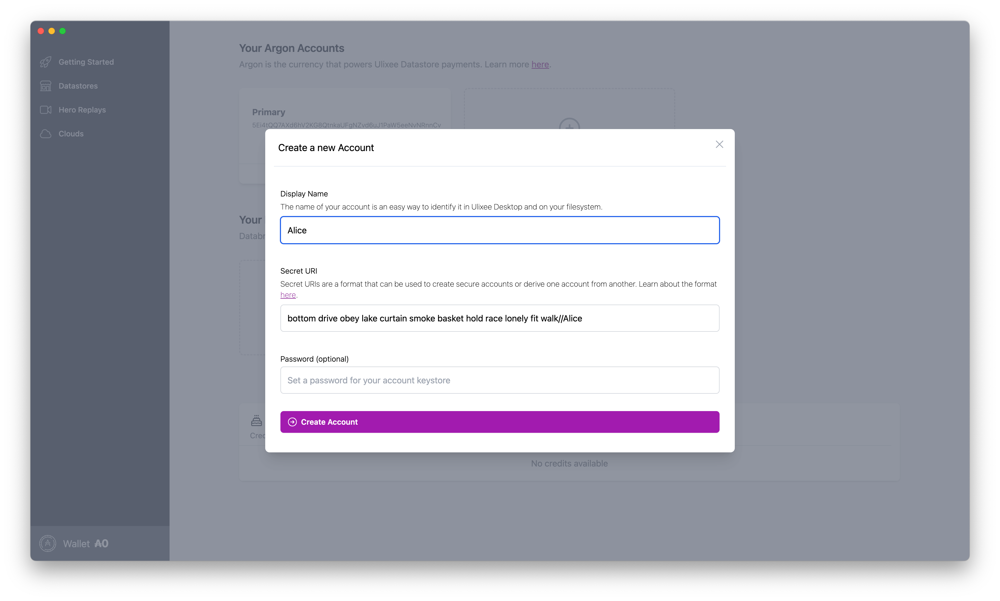
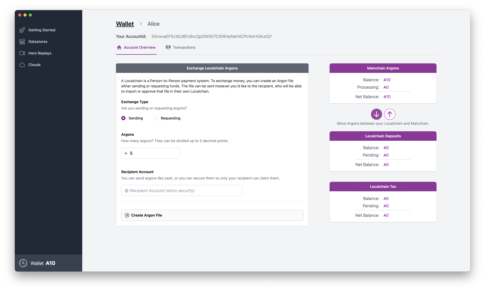
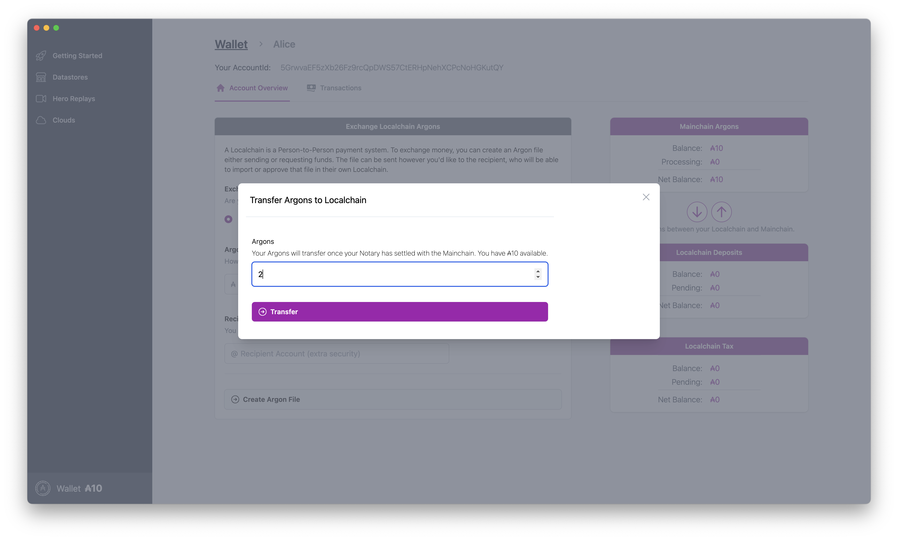

# Using the Argon Localchain

When you create an [Argon](https://github.com/argonprotocol/mainchain) account, you'll be able to use that account to access both a "Mainchain", which is like a traditional decentralized blockchain, but you'll also get a "Localchain" account. A Localchain is like a personal blockchain where your computer will hold the balance of the account and you can send "Notes" to other users, which represent fund transfers.

NOTE: the commands in the Argon github page are about the rust based localchain, but you can interact with the Localchain in nodejs directly using the `@argonprotocol/localchain` module, as well as the [Ulixee Desktop](https://github.com/ulixee/desktop) app, which has a more visual interface.

### Argon is in Testnet

The Argon is currently in a Testnet phase. The tokens are purely for experimental purposes and hold no value. The network is not secure and is not meant for production use. The Testnet will be reset periodically, and all tokens will be lost.

Follow along with the Argon project [here](https://github.com/argonprotocol/mainchain).

## Core Concepts

You can read about the core concepts of a Localchain [here](https://github.com/argonprotocol/mainchain/tree/main/docs/localchain.md).

Within Ulixee, the "Localchain" represents the primary way that you'll interact with the Argon network.

### Dual Chain Accounts

A single address or "account" can be used on both the Mainchain and Localchain. The Mainchain is a public blockchain that is used to store the state of the network, and focuses on keeping the Argon price stable. The Localchain is a personal blockchain that allows for direct, fast p2p payments.

### Notaries

A notary is a rollup service that will verify and then aggregate your personal blockchain transactions into a single transaction on the Mainchain called a "Notebook". The Mainchain works with an agreed time-state called "ticks", and Notebooks must be submitted in order for each tick. Once your "balance change" is in a notebook, it's considered final - there's no fee or acceptance process for a notebook beyond it having all valid transactions per network rules.

### Localchain Internals

If you want to explore whats in your Localchain, you'll find a folder in the [`Data`](../overview/configuration.md#data) directory of your operating system where a SQLite database is created per Localchain account. In nodejs, you can use the `npx @argonprotocol/localchain` cli to interact with your Localchain.

### Datastore Payments

You can create a Localchain account for your CloudNodes. Your Localchain can be considered a "hot wallet" - the funds on that machine are locked by any passphrase you put on there, but they are not as secure as a "cold wallet" (like a hardware wallet). You likely want to periodically transfer funds from your Localchain to a Localchain not connected to your public cloud. See below for how to [transfer out funds](#export-localchain-funds).

Localchains allow for micropayments down to one millionth of an Argon (which is ~ one millionth of a penny). This allows for a very fine-grained payment system that can be used to pay for things like queries, storage, and other services. Learn more [here](../basics/payments.md).

### Datastore Query Payments

A consumer of a Datastore will use [Localchain Argons](../basics/payments.md) or a [Databroker](../advanced/databrokers.md) to pay for queries. Queries can be paid for one by one without any form of long-term account, and your funds will be valid on every Datastore. That allows us to do things like [Cloning](../basics/cloning.md), which ensures everyone receives payment for their work.

### Databrokers

Databrokers allow a user to take advantage of the simplicity of Argon payments without worrying about keeping a Localchain account funded. They're like an API service you might put your credit card into. In the Testnet, you can use the Ulixee Foundation's Databroker for free. In the future, you'll be able to use other Databrokers for a fee. Find out more [here](../advanced/databrokers.md).

### Domains

Localchains are able to lease "Domains" in Argon, which allow a Datastore author to communicate version hosting and payment information to users. More [here](./register-a-domain.md).

## Create an Account

You need to first create an Argon Account. Follow the directions [here](https://github.com/argonprotocol/mainchain/blob/main/docs/account-setup.md). You should have a seed phrase and an account address once you're done.

The Argon docs show you how to create a Localchain account with the cli:

```bash
$ npx @argonprotocol/localchain accounts create --name="alice" \
  --suri="bottom drive obey lake curtain smoke basket hold race lonely fit walk//Alice" \
  --key-password="password" 
  --mainchain-url="wss://rpc.testnet.argonprotocol.org"
```

You can also create an account in Ulixee Desktop in the "Wallet tab":

> 

## Create a Seed Phrase

You can create a seed phrase using a lot of tooling online that generate 12-24 word mnemonic phrases. You can also use the [Polkadot.js Developer Console](https://polkadot.js.org/apps/?rpc=wss%3A%2F%2Frpc.testnet.argonprotocol.org#/accounts) to create an account and get a seed phrase if you have enabled `Allow local in-browser account storage` in the Settings tab. Or you can create mnemonic phrases manually using the [@polkadot/util-crypto](https://polkadot.js.org/docs/util-crypto/examples/create-mnemonic/) library.

```typescript
const {
  mnemonicGenerate,
} = require('@polkadot/util-crypto');

async function main () {
  const mnemonicAlice = mnemonicGenerate();

  console.log(`Generated mnemonic: ${mnemonicAlice}`);
}

main().catch(console.error).finally(() => process.exit());
```

## Transfer In Funds

Once you've created an account on the Mainchain and a corresponding Localchain account, you can transfer funds into your Localchain account. You can do this using the `@argonprotocol/localchain` cli:

> NOTE: This will take a few minutes to process, as it requires the block that includes your transaction to be finalized on the Mainchain. Mainchain blocks close once a minute, but finalization occurs as a consensus outside of that process. It can vary from a few seconds to several minutes.

```bash
$ npx @argonprotocol/localchain accounts from-mainchain 5.0 \
  --name="Blake" \
  --mainchain-url="wss://rpc.testnet.argonprotocol.org"
```

Or using the Ulixee Desktop Wallet:



## Person-to-Person Payments

If you need to reload your Localchain (named `BlakeDatastore`) because it's paying for Data queries, or embedded in a Datastore to pay for data from Cloned Datastores, you can move funds to your account from a Localchain on another machine.

Assuming you have a Localchain account on your local machine called `Funds`, you'll create a signed half of a balance change to send to `BlakeDatastore` (whose address is `5GrwvaEF5zXb26Fz9rcQpDWS57CtERHpNehXCPcNoHGKutQY`):

```bash
$ npx @argonprotocol/localchain transactions send \
  50 5GrwvaEF5zXb26Fz9rcQpDWS57CtERHpNehXCPcNoHGKutQY \ 
  --name="Funds" \ 
  --mainchain-url="wss://rpc.testnet.argonprotocol.org"
```

This will output a file that you'll upload to the `BlakeDatastore` machine to complete the transaction. On your remote machine, you'll run:

```bash
$ npx @argonprotocol/localchain transactions receive <path-to-file> \
  --name="BlakeDatastore" \ 
  --mainchain-url="wss://rpc.testnet.argonprotocol.org"
```

## Export Localchain Funds

If you want to export funds from your the `BlakeDatastore` Localchain to a more secure Localchain, you can inverse the process above, generating a signed balance change request on `BlakeDatastore` and then sending it to your more secure machine.

From `BlakeDatastore`:

```bash
$ npx @argonprotocol/localchain transactions send 50 \ 
  5Gsecureaddress... \
  --name="BlakeDatastore" \
  --mainchain-url="wss://rpc.testnet.argonprotocol.org"
```

Then you would FTP this file back to your secure machine, and run:

```bash
$ npx @argonprotocol/localchain transactions receive \
  <path-to-file> \
  --name="SecureMachine" \
  --mainchain-url="wss://rpc.testnet.argonprotocol.org"
```
